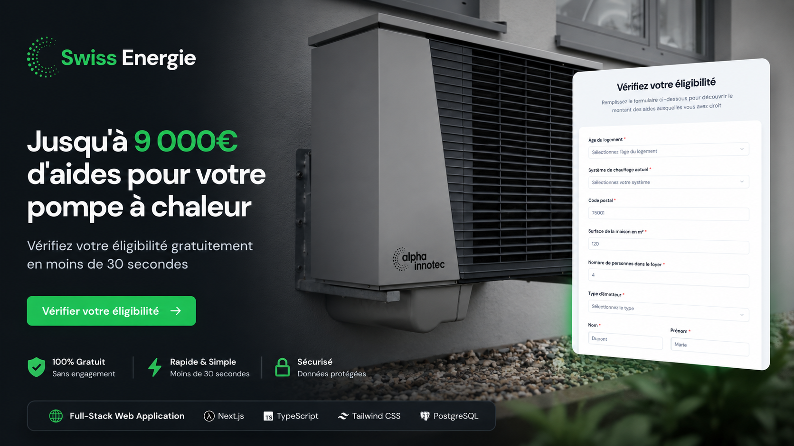

# Swiss Energie Website

## Project Overview

Responsive website created for Swiss Energie, a service-based company focused on energy solutions.

The project presents the company, its services and contact options through a clear structure, mobile-friendly layout and conversion-oriented user flow.

## Objectives

- Build a professional online presence
- Present services clearly
- Improve trust and credibility
- Make contact and inquiry actions easy
- Create a clean and consistent digital identity

## Approach

The website was structured around clarity, credibility and user experience.

The goal was to make the services easy to understand while keeping the layout clean, responsive and adapted to a service-based business.

## Key Skills

- Website structure
- Responsive layout
- User experience
- UI layout
- Content organization
- Visual hierarchy
- Conversion-oriented flow
- Digital brand presentation

## Live Website

https://swissenergie.pro/

## Source Code

The website source code is available as a downloadable ZIP file in this repository.

## Status

Completed
